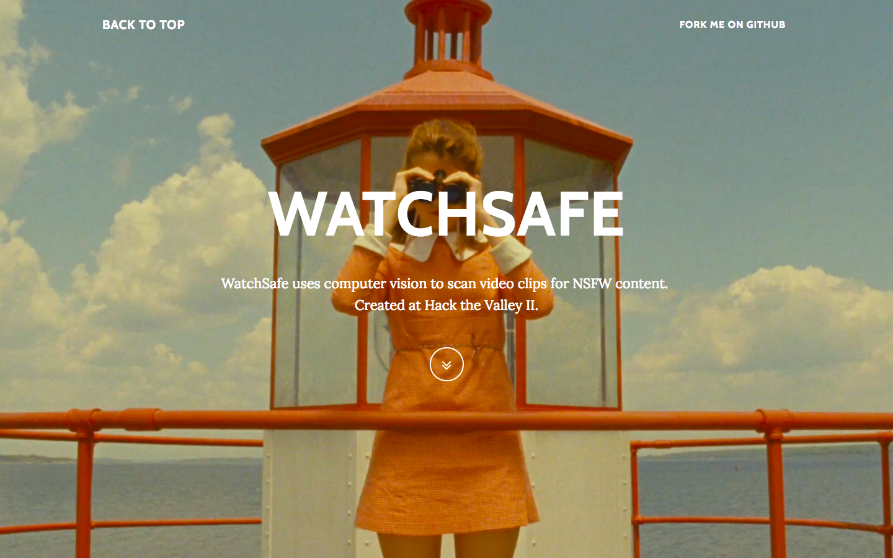
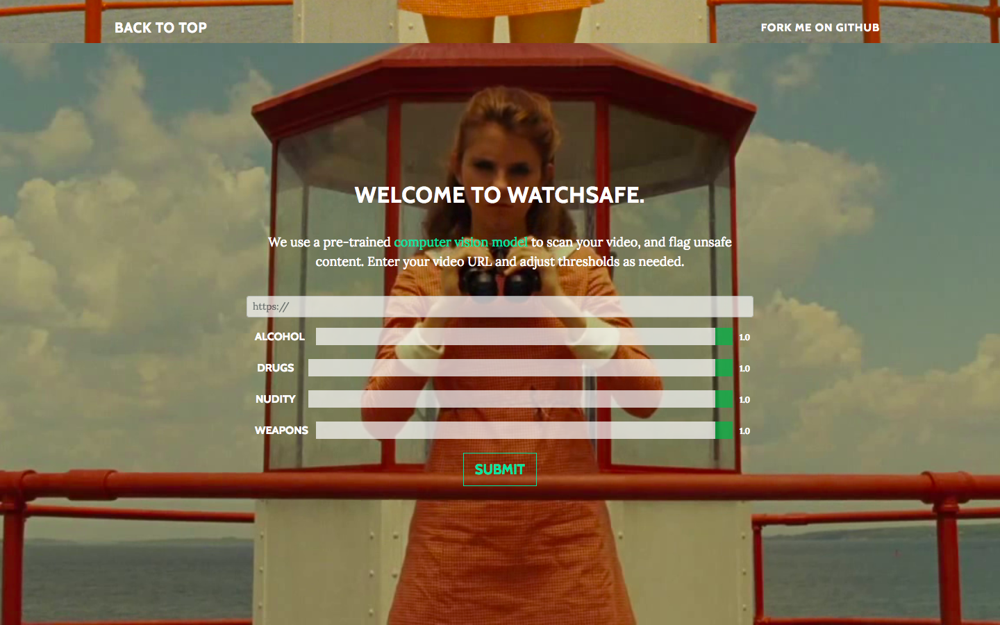
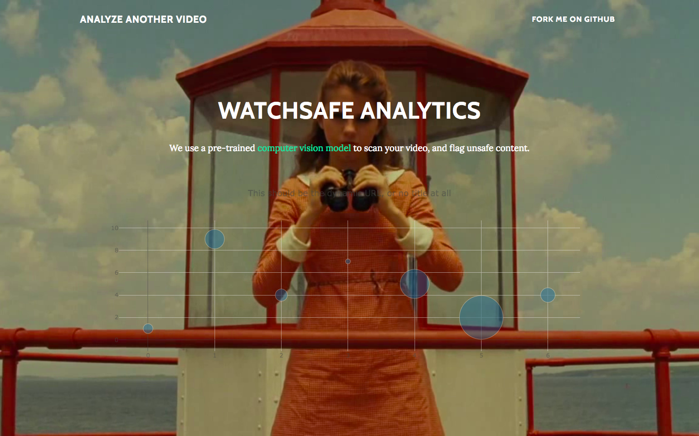

# WATCHSAFE

## Hack The Valley II

*watchsafe* uses **computer vision** to scan video clips for nsfw content by flagging the start and end of the nsfw content, and displaying the type of nsfw content (drugs/nudity/gore).

## Landing Page

## Analytics Page

## About
WatchSafe uses computer vision to analyse video clips for NSFW content.

The problem with online censorship is that a human has to spend time watching the entire video, then they tag the video as NSFW. The entire video gets flagged - like in movie theatres, movies get rated R. But - why is that? What if there was a better way to do it? Think about movies like Apocalypse Now - movies with violent scenes that aren’t necessarily integral to the plot.

### WatchSafe:
* uses pre-trained computer vision models to scan an entire video
* flags the type of content (for nudity, violence, alcohol, and drugs) with adjustable threshold values in real time via JavaScript's Plot.ly libary
* Blacks out parts of the video clip, and embed it within the site for playback.

Parents can use WatchSafe when showing movies to kids, teachers can use WatchSafe to show educational movies that adhere to school regulations, WatchSafe can be used for crime scenes - we save a lot of human viewing hours and catch things the human eye could miss.

### Next Steps
In the future, we'd like to:
* implement real-time playback 
* move WatchSafe to a Chrome extension
* embed already analysed URLs in a MongoDB database

### Technology
* SightEngine API
* Flask back-end
* Deployed on Amazon AWS

### Links
[Video Demo](https://www.youtube.com/watch?v=_Wwa5B8vHKo "Video Demo")
[Devpost](https://devpost.com/software/watchsafe "Devpost")
